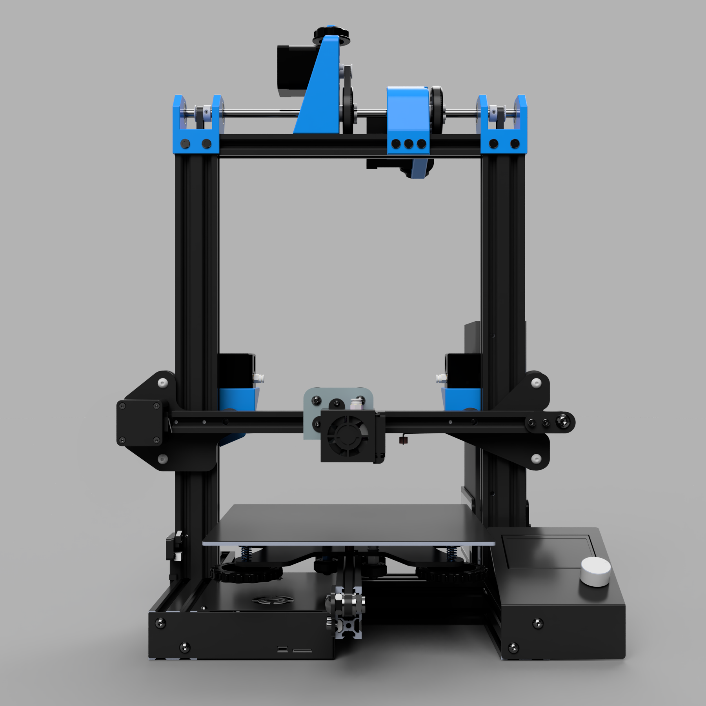
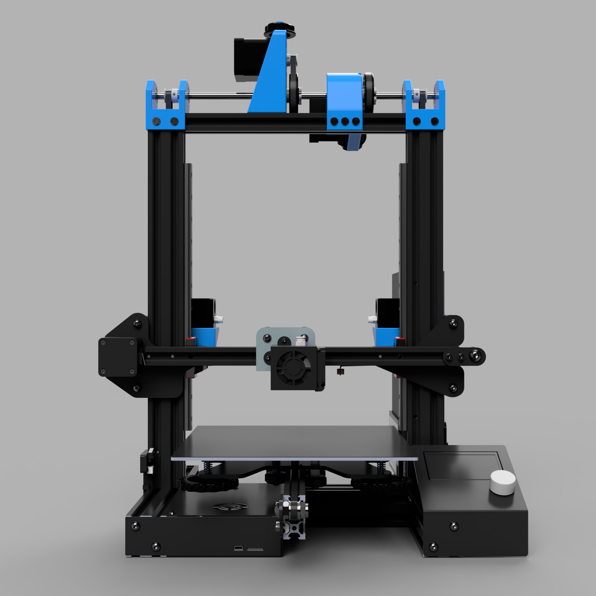
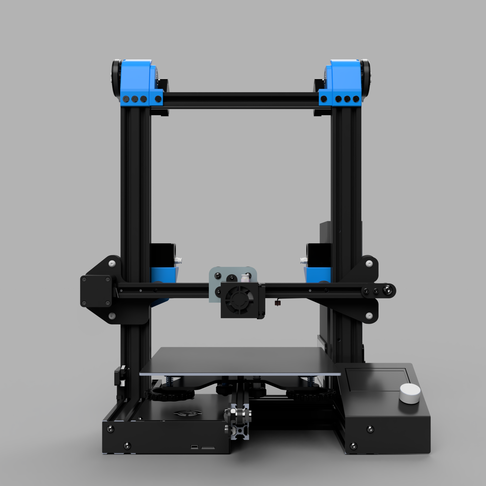
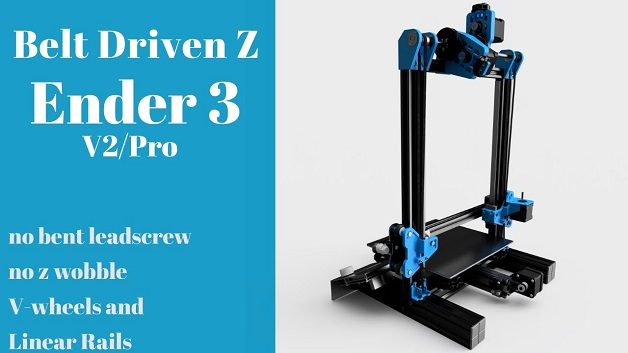
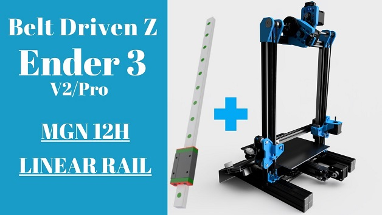

# BeltDrivenEnder3

### Versions/Variants
1: Stock V-Wheels        |  2: MGN-12H   |  3: Dual Z (Wheels and MGN)
:-------------------------:|:-------------------------:|:-------------------------:
  |   |  

This mod now exists in the 3rd version (V3). The upper V1 and V2 folders contain the files for the old versions. The current version (V3) exists in 3 variations:V-Wheels, MGN-12h and Dual Z (Dual Z works with both variants V-Wheels and MGN-12h). In addition, you can choose between unrotated and rotated transmission (not for Dual Z). I hope this clarifies the confusion between the versions and variants.

---

### Please read Instructions and BOM for more informations.

Feel free to contact me on Discord: kevinakasam#2097

Huge thanks to my mate Deutherius, who helped me over months, tested everything and brought this mod to perfection. Many thanks for the help, the photos and the new heated bed!
 

 

### Hello and welcome to the Belt Driven Z Mod. First of all, I would like to note a few things:
### Attention!
I'm not an expert and 3D printing is my hobby. So please be careful when you rebuild this mod and don't just go ahead. For my printer the parts fit perfectly.
Everybody bears the risks of a modification himself.
All parts can be modified as you like. :D

### Why I made the Mod:
My Ender 3 always had problems with the Z-axis, which were caused by a bent and misaligned leadscrew. Therefore I decided to convert the Ender to belts in Z as well.
This mod also solves the problem of a hanging x-axis on the right side. Because of the two belts, both sides run synchronously and can also be adjusted very precisely.
So if you have these problems with the z-axis/x-axis, this is a good solution.

### What this Mod can't do:
This mod can't solve problems that are caused by an inconsitent extrusion. Inconsitent extrusion means an untuned Flowrate/Extrusion multiplier and causes very inconsitent layers --> this looks like the picture below. To get rid of that you should tune all extrusion related values, like Flowrate an Linear Advance (Marlin) / Pressure Advance (Klipper). Take a look at this [tuning guide](https://github.com/AndrewEllis93/Print-Tuning-Guide), its very well made (Works also for non Voron Printers and Marlin machines). 

 

### A word about *linear rails*.
There's a reason I haven't made a rail version in a very long time: Rails are not better than rollers in ***terms of quality***. At least the cheap rails you can buy on AliExpress. The tolerances are not good, they don't last long and can give z artifacts that you don't have with rollers. From time to time I get messages that the x axis drops as soon as the power is turned off. Every time that happens the mod uses rails. And like almost of those has cheap china rails. The problem with these cheap rails is that there is no friction at all, no tension and the Z axis is very poorly guided. The little Z motor has to carry all the weight because the rails are so loose they can't take any load. 
You also have to take care of the rails, lubricate and clean them from time to time, and make sure they don't leak. So you will spend a lot of money on a set of rails if you want good rails. Plus lubricants, cleaners, etc. Also, mounting the rails is more complicated. With wheels, you spent almost nothing on a new wheel, put it on, and you are good to go.
So I recommend trying wheels first and if you still want rails, you just need to print two small adapters to install the rails. Keep things simple ;)

### Print settings
All Parts can be printed without support. Keep the orientation for best results. Yes, you can use PLA but no, you shouldn’t use PLA. I used PETG for the unenclosured, ABS for the enclosured printer. Suggested print settings: 50% Infill, 5 Walls/Top-Bottom layer.
Good luck and happy printing!

### Find the right STL files:
*The V3.x means the current version. There may be some changes compared to the older versions. If you’re using an older version that’s totally fine.
Check the Bom for a list of printed parts you need.
If you like to have a minimum height of the printer (e.g. Enclosure) then please use the rotated version. Theres also a version with an extra bearing (e.g. "1_transmission_rotated_bearing.stl") to support the rod as much as possible.*

- #### Bowden Setup
  For a stock Ender 3, please use the 1_LeftV3.x_Bowden **or** 1_RightV3.x_Bowden. (Left for stock extruder position)

- #### Direct Drive Setup
  For a DDE setup, please use 1_LeftV3.x **and** 1_RightV3.x.

- #### Normal V-Wheels/Rollers
  Just use the files from the "V3" folder.

- #### MGN-Rails
  You need the files from the "V3_MGN" folder **in addition** to the V3 folder. But you do not need the printed spacers ("3_Spacer2.stl").

- #### Dual Z G34
  For a dual Z setup with two z motors use the files from the "Dual Z" folder **instead** of the transmission and top parts from the V3 folder. The rest is still the same, works with V-Wheels and MGN-Rails.
  
### How to use the toothed idlers
You have to remove the flage of the toothed idlers, otherwise they would get in contact with the profile.

## Thank you Voron
This mod uses a modified transmission from the Voron 2.2. I made a different frame to mount it on the Ender 3. The tensionerarm and the tensionerring are from the Voron guys. These aren’t my work!!! The mount and the 80T gear are made by myself. Because the parts will be updated regularly, you can find the STLs I used on GitHub 

## THANK YOU VERY MUCH!
I want to thank everyone who has helped me over the last months with feedback, support and confidence. Without you this mod would not have become so big! Thanks also to Creality for the Golbal DIY Contest. I am very proud to announce that I could reach the 3rd place with.

## Print Showcase
 
 
 

## Finally the video tutorials are finished!

https://youtu.be/bxTwFCPEIgg

https://youtu.be/oUdoJUs8Zcg

## Keybak
#### Files are currently untested! Please give me feedback when you installed the Keybak (Discord: kevinakasam#2097)

 

Keybak system similar to the Switchwire design.
The files were remixed from the Switchwire CAD file.
For licensing reasons, all Keybak files are uploaded to GitHub only!
Idea from Voron team, thanks!

Info: Because of the transmission it is not necessary to install a Keybak system.
The 1:5 ratio increases the holding force of the motor so that it can hold the X axis up even when it is powered off.
A correctly adjusted belt tension is important for this.
If you are using the V-Wheels it is also important that they are installed correctly (See Troubleshooting).
From time to time I hear that users struggle to keep the axis up by using the belt tension only.
Therefore, I have designed the Keybak system. See BOM for all the parts you need.

What is a Keybak system and what is it for?
A Keybak is actually used to secure keys to a wire rope.
Depending on the Keybak, they can support a lot of weight without the cord extending on its own.
The Keybak used here is strong enough to support the x axis. It takes the load off the motor and shares the weight of the axis with it.
__It is still important to tension the belts properly!
If the belts are not tightened enough, there will be unclean prints later!__
So make sure that the Keybak doesn't mislead you into not tightening the belts enough.
See my FAQ video on how to properly tension the belts (video coming soon).

You will have to print a new 1_LeftTop_A and a 3_spacer to use the Keybak.

## FAQ 
### Do I need to change the firmware?
NO! You do not have to change anything in the firmware. This modification works with the stock board and stock firmware.

### Can I use PLA to print the parts?
Yes and no. All parts should work with PLA, except the motor tensioner arm. The motor has to hold more weight now, so the motor could get warm. Since PLA deforms at ~40°C you should keep an eye on your motor (see troubleshooting). Because of that I would recommend PETG. When you're printing inside an enclosure you should use ABS. Try Esun ABS+, super easy to print, and much stronger than PETG.

### Is this mod also compatible with the Ender 3 V2/Pro etc?
YES! You can use this mod with all Ender 3 versions.

### Can use this for my Creality CR printer?
View the makes on Thingiverse. Some of you made a CR build so I thing it should fit. Feel free to give some feedback about that.

### Do I need a hardened steelrod?
NO! A cheap aluminium or "normal" steelrod is just fine. There's also a transmission (rotated and unrotated) that hold a bearing inside, so you have some extra support in the middle of your rod. You also could use your leadscrew to minimize the costs.

### Dual Z? G34?
So you want to use two stepper motors to have an indipendent z axis? Thats possible of course! Just use the files from the Dual Z folder!

### I have a special question/ I need a custom version but I'm new to CAD. Can you help me?
Yes of course! I'm happy to help, so please contact me via Discord (kevinakasam#2097). I'm sure we will find a solution for your problem :)

### Can I support your work?
Thank you very much if you want to support my work! But please dont feel obligated to do so. All parts are free and open source and will stay that way! If you still want to support me, you can find a donation link at the bottom of this page. Really many many thanks! :)

## Troubleshooting
### My Z motor moves in the wrong direction!
Thats a quick fix. Just remove all the pins in you motor connector that goes into the mainboard (like I showed you in my video) and insert them in the opposite order (4321 instead of 1234).

### My Z motor gets super hot!
First of all: A warm or slighty hot motor isn't a super bad thing. But you should change that. Try to lower your V-ref/Amps till the motor stays hand warm. But be careful to not reduce the current too much, or your motor will lose steps. The stock Z motor is very small so it's a big job for the tiny motor. Don't worry if your motor gets warm.

### My z axis drops as soon as power off my printer!
Probably the most asked question, but I can promise that your axis does not have to drop! As already mentioned, the z motor is very small. Therefore the magnetic field that exists in the motor even without power isn't very strong. But it's strong enough to keep the axis up.
#### I don't care, my axis is dropping, what can I do?
1. You are using the original V-Rollers? Be sure they are properly set up. Turn the eccentric nut until the rollers are in contact with the profile. Put a little tension on the rollers, but not too much! Do not risk a flat spot of your rollers. The tension is correct when they are tight, and you can't turn them with your finger in the same place, but the axis moves when you turn the rollers.
2. You have no rollers or your axis is still dropping? Tension your long belts a little more. Increase the tension until your axis stops dropping. Be careful not to break something. But the parts can take a lot of tension. Otherwise, check out my FAQ video about how to tension the belts (THE VIDEO HAS STILL TO BE CREATED).
3. Tension the small looped belt a bit more as well. But very carefully! Usually the tension only needs to be high enough to keep the belt from slipping over the printed wheel. But you can increase the tension a little bit. But not too much, otherwise the motor can't turn anymore.
4. That sounds too complicated? Your motor is also too hot? A solution would be a bigger motor, like the one on the X and Y axis. A bigger motor is able to hold the axis up very easily, with less tension and less heat. But as I said, this is not necessary, it also works with the original motor.
5. New solution: Install the Keybak System (added 31.10.2021).

---
### Changelog:
19.01.2022: Small Changes
- Added the V3_Extra folder to store the customizations I made for you.
- Added the small hole in the V3.5 plates again for the belt from the tensioner block.

09.01.2022: Second big Update: **V3.5**
- Adjusted the Belt path so they're parallel now. This was requested quite often, sorry it took so long.
- Added a version for toothed bearings. 
- Added Dual Z Version.
- Removed upper holes in the Top parts, so you do not have to unscrew the top profile.

31.10.2021: Big Update!
- Moved the extruder to the stock position for the V3.4_Bowden plates (Fits BMG now too). Idea from trohnjavolta, thanks!
- Split the tops into two parts to make them easier to print and more stable (Top_A and Top_B). Idea from sztywniutko (Thing:4911634), thanks!
- Added a PSU mount.
- Added a Keybak system similar to the Switchwire design. The files were remixed from the Switchwire CAD file. For licensing reasons, all Keybak files are uploaded to GitHub only! Idea from Voron team, thanks!

17.08.2021: Made some small tolerance changes to the rotated transmission and the inner M3 parts.

31.07.2021: I made a mistake and uploaded the wrong files for "LeftTop" and RightTop". If you downloaded the files from Thingiverse between 15.06.2021 and 31.07.2021, please download the latest version. I am very sorry! Thanks to mbarryton for the hint!

15.06.2021: **Important!!!** Both Versions (rotated and unrotated) are compatible now. Both versions now have the identical LeftTop and RightTop (the one from the rotated version).

15.06.2021: I have added a version of both transmissions that include a ball bearing. So the rod is supported in the middle by another ball bearing.

15.06.2020:  Updated CAD with all Versions. Many thanks to Regulus who did a great job adding many wonderful details to the CAD file. All parts are now properly aligned, all fasteners are added and named. Seriously many many thanks!

02.06.2021: Added Left and Right V3.3. Changed the design of the lower clamp profile. If youre using the 3.1 or 3.2 that's totally fine;)

02.06.2021: Updated the 80T Gear on GitHub. reduced the outer diameter a bit so theres a bigger gap to the profile. Thanks to Regulus!

06.05.2021: Modified MGN Version fits now for Ender 3 (Pro) and Ender 3 V2. Bowden Version tested. Thanks to Jon!

04.05.2021: Added a Video Tutorial.

02.05.2021: Added Left and Right V3.2. Tensioner were missaligned by ~0.5mm. Thanks to Zardozer for the hint! If youre using the old V3.1 its totally fine. I'm using them as well:D

14.02.2021: Changes for the MGN Version!! LeftV1 added. Please print 1_Left and 1_LeftV1. I would appreciate feedback for Left or LeftV1. I have created the files with the official CAD, but the M4 screws differ in the position by 2mm. Please print both versions and tell me which fits, thanks:)

26.02.2021: Added Bowdenversion.

26.02.2021: Started Changelog.

--- 
Donation Link: https://www.buymeacoffee.com/kevinakasam
